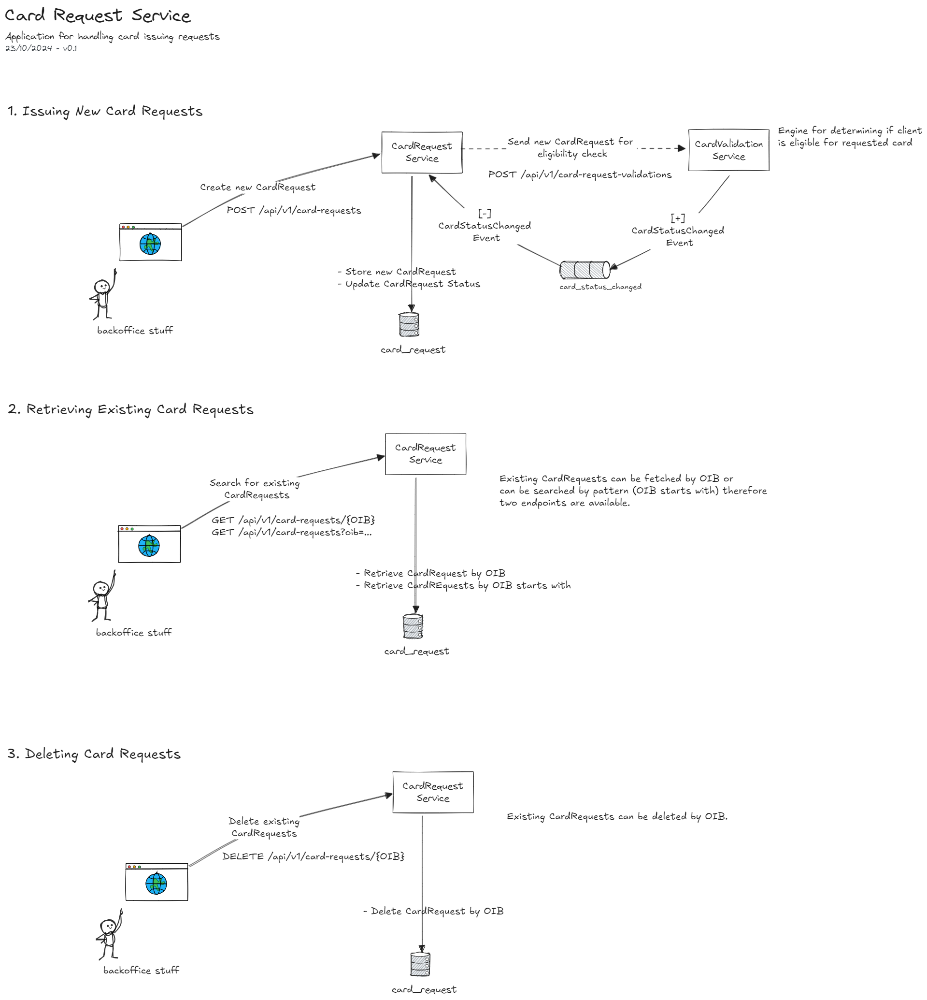

# Card Request Service

Banka izdaje kreditne kartice fizičkim osobama koje apliciraju za iste.
Potrebno je razviti mini-aplikaciju za evidentiranje klijenata koji traže izradu kreditnih kartica.
Svaki klijent ima sljedeće atribute: Ime, Prezime, OIB i Status kartice (statusi proizvoljni npr.
&quot;Pending&quot;, &quot;Approved&quot;, &quot;Rejected&quot;,…).
Aplikacija treba osigurati permanentno spremanje podataka, preferirano u bazu podataka
(npr. H2) ili datoteku.

## Sample Process Diagram
U nastavku se nalazi diagram procesa izdavanja kartica. Arhitektura je napravljena tako da zadovoljava tehničke momente zadatka.



### Executing application
Before executing application several environment variables should be set:
```
set CLUSTER_API_KEY=...
set CLUSTER_API_SECRET=...
set VALIDATION_SERVICE_PASSWORD=test
set VALIDATION_SERVICE_USERNAME=test
```
Application can be started with the following command:
```
mvn spring-boot:run
```
